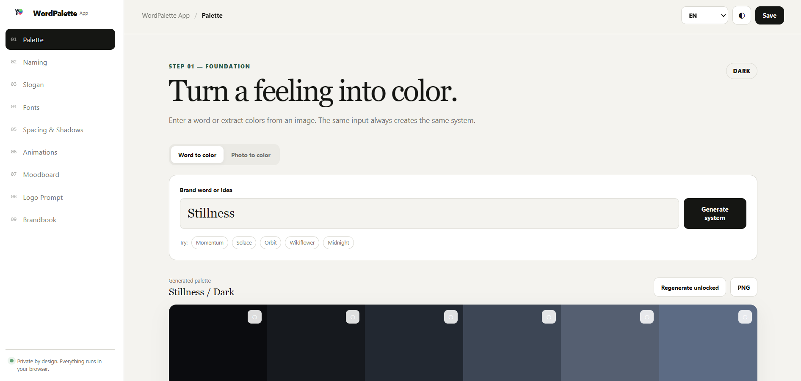

# WordPalette

Generate a complete mini brand system from a single word or image — fully in your browser.

## What is WordPalette?

WordPalette is a free, static, browser-only brand identity generator. Enter a word, idea or upload
an image, and the app creates a visual direction for your project: palette, naming ideas, slogans,
typography, design tokens, animation presets, moodboard, logo prompt and compact brandbook.

Everything runs locally on your device. There is no backend, no account, no API key and no image
upload.

## Features

- Word-to-palette generator — create a deterministic color palette from a brand word or idea.
- Image-to-palette extraction — upload an image and extract colors locally with Canvas.
- Palette harmonies — switch between analogous, complementary, triadic, split complementary,
  monochrome and neutral accent palettes.
- Color locking — lock colors you like and regenerate only the unlocked colors.
- Saved palettes — save palettes in your browser with `localStorage`.
- Naming ideas — generate brand name ideas based on the current word, mood and industry.
- Slogan generator — create short tagline ideas for the selected brand direction.
- Font pairings — get browser-safe typography pairings matched to the current palette.
- Design tokens — generate spacing, radius and shadow tokens for UI design.
- Animation presets — preview and copy simple CSS animation snippets.
- Moodboard — see the palette, typography and tokens together in a visual layout.
- Logo prompt builder — generate a logo brief/prompt for designers or image-generation tools.
- Brandbook — create a compact brandbook with colors, typography, slogans and naming ideas.
- Exports — export PNG, JSON, CSS variables, Tailwind-style tokens and Figma token JSON.
- Multi-language UI — supports English, Russian, Spanish, French, German, Italian, Portuguese,
  Chinese, Japanese and Arabic.
- Privacy-first — no uploads, accounts, analytics, external fonts or backend services.

## How to use

1. Open the app in your browser.
2. Type a brand word or idea, for example `Stillness`, `Orbit`, `Momentum` or `Midnight`.
3. Click **Generate system**.
4. Review the generated palette.
5. Use harmony buttons to change the color relationship.
6. Lock colors you want to keep, then regenerate the rest if needed.
7. Open the sidebar sections to explore:
   - **Naming** for name ideas
   - **Slogan** for taglines
   - **Fonts** for typography
   - **Spacing & Shadows** for design tokens
   - **Animations** for CSS motion presets
   - **Moodboard** for a visual preview
   - **Logo Prompt** for a logo generation brief
   - **Brandbook** for export-ready brand assets
8. Click **Save** or **Save current** to store the palette locally in your browser.
9. Export what you need as PNG, JSON, CSS, Tailwind tokens or Figma tokens.

## Image palette mode

You can also create a palette from an image:

1. Open **Photo to color**.
2. Choose a PNG, JPG or WEBP image.
3. WordPalette extracts the main colors locally in the browser.
4. The image never leaves your device.

## Exports

WordPalette can export:

- Palette PNG
- Moodboard PNG
- Brandbook PNG
- Brand system JSON
- CSS variables
- Tailwind-style token object
- Figma-compatible token JSON

## Privacy

WordPalette is local-first:

- No backend
- No database
- No account
- No API keys
- No analytics
- No external fonts
- No image uploads

Generated palettes and saved history stay in your browser.
